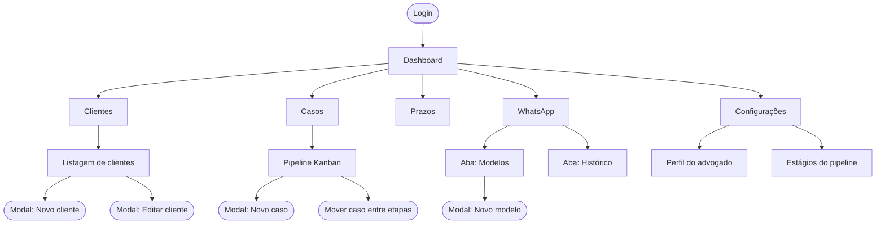
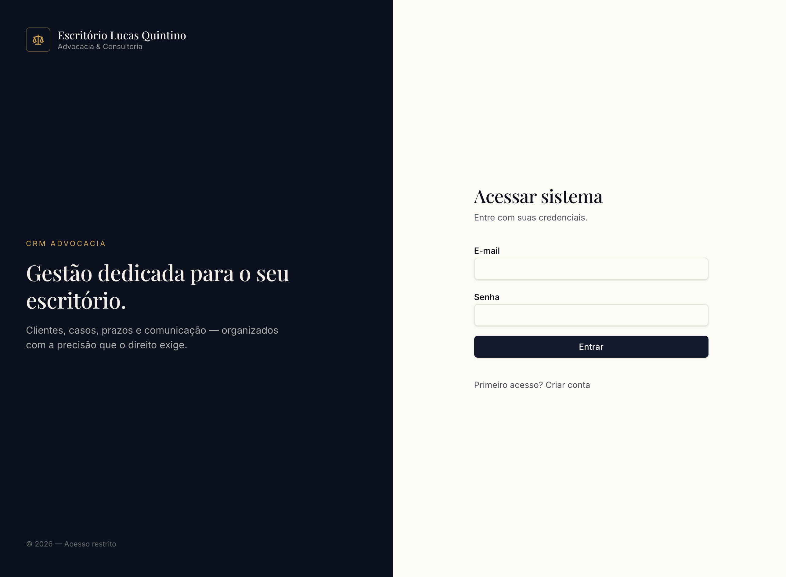
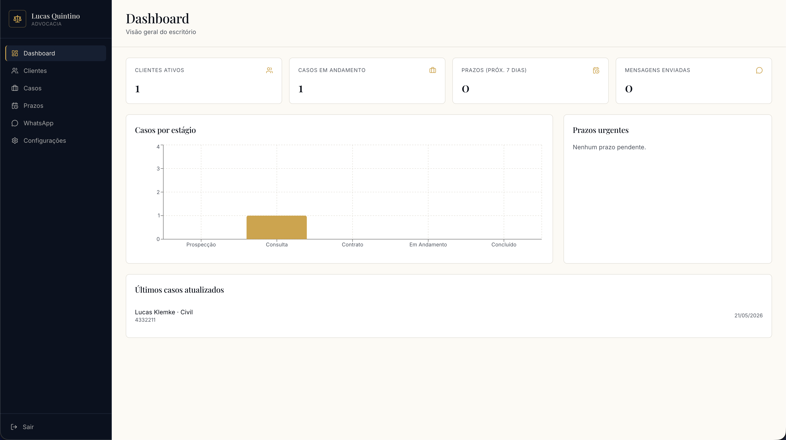
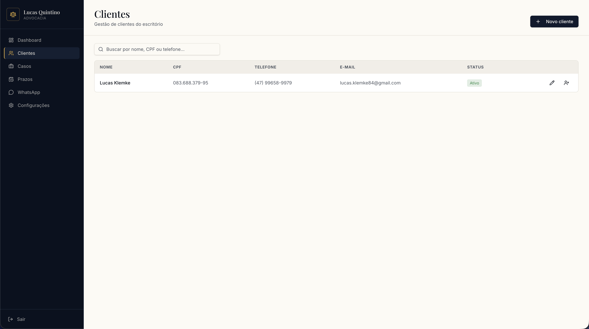
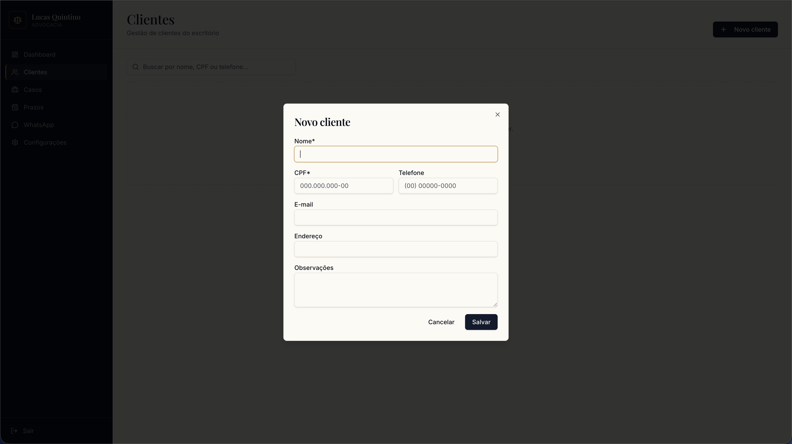
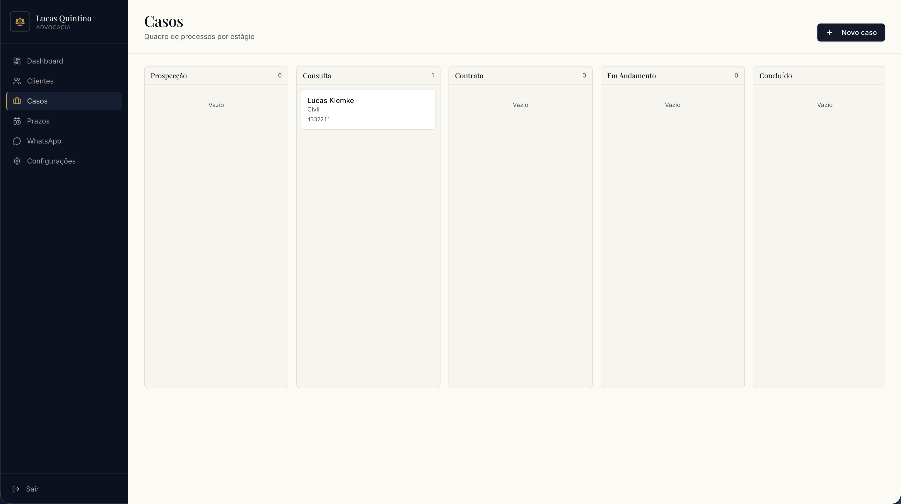
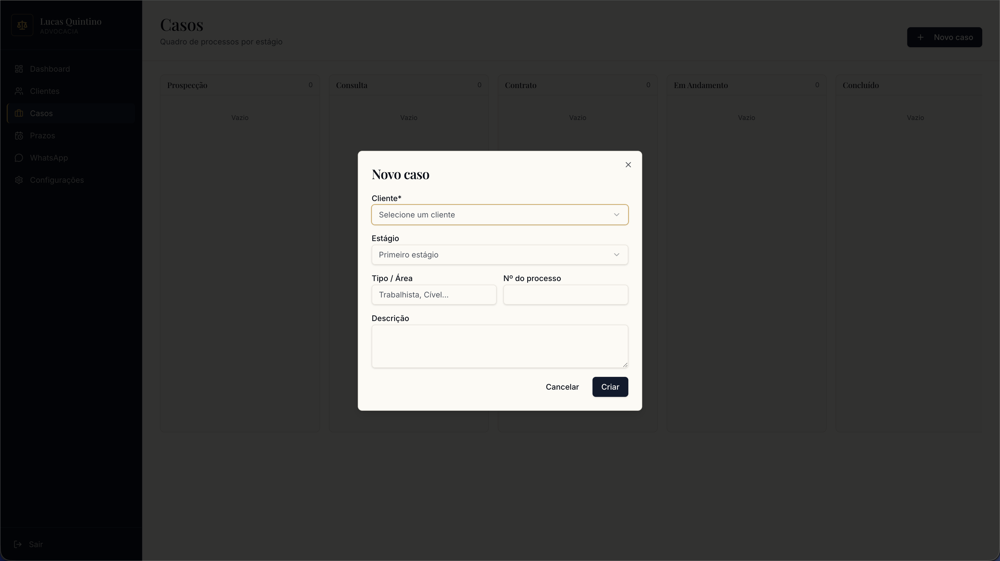
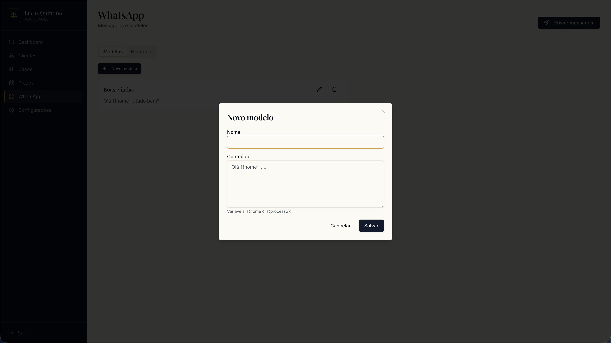
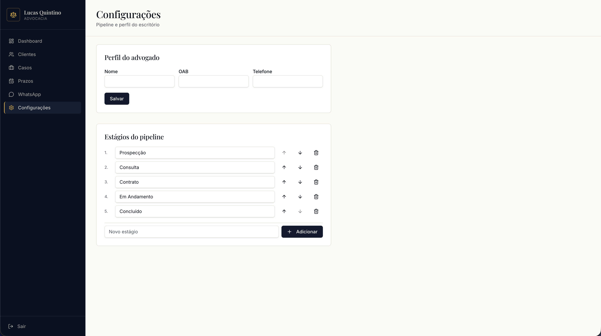

# RFC: Request for Comments — Projeto de Portfólio

**Engenharia de Software – Católica SC**

---

# Identificação

- **Título do Projeto:**  
  CRM Advocacia - Escritório Lucas Quintino

- **Linha de Projeto (Direction):**  
  Web

- **Autor:**  
  Lucas Affonso Klemke

- **Data da Proposta:**  
  11/04/2026

- **Versão:**  
  1.0

---

# 1. Visão do Produto e Impacto (O Problema)

O objetivo desta seção é responder uma pergunta fundamental:

**Este projeto resolve um problema real ou é apenas um exercício técnico?**

---

## 1.1 Contexto e Problema

O advogado Dr. Lucas Quintino é o principal afetado pelo problema, que ocorre no contexto da rotina diária do seu escritório, durante a gestão de clientes e o acompanhamento de processos jurídicos.

Atualmente, esse controle é feito de forma manual, utilizando planilhas, anotações pessoais e conversas dispersas no WhatsApp, sem nenhuma ferramenta centralizada.

As soluções existentes no mercado, como CRMs voltados para advocacia, apresentam alta complexidade e um volume de funcionalidades desnecessário para um advogado em início de carreira, além de representarem um custo elevado. O advogado necessita uma solução personalizada, adequada à sua realidade e às suas necessidades atuais.

---

## 1.2 Origem da Demanda e Evidências

### Demanda Externa

O projeto foi solicitado pelo escritório de advocacia do Dr. Lucas Quintino. O escritório enfrenta dificuldades na organização e centralização dos dados de clientes, no acompanhamento de atendimentos via WhatsApp e na visualização clara da etapa em que cada cliente se encontra dentro do fluxo de trabalho.

---

### Pesquisa com Usuários

---

### Evidência de Interesse

---

## 1.3 Análise de Soluções Existentes (Benchmark)

### 1. ADVBOX

**Link:** [advbox.com.br](https://advbox.com.br)

**Público-alvo:** Escritórios de advocacia de pequeno a grande porte.

**Funcionalidades principais:** Gestão de processos, CRM jurídico com kanban, controle de prazos e intimações, financeiro integrado, produtividade por equipe (método Taskscore) e inteligência artificial.

**Preço:** A partir de R$180/mês (plano Essencial) podendo chegar a R$1.200/mês (plano Elite).

**Limitações:** Voltado para escritórios que já possuem volume considerável de processos, com muitas funcionalidades que um advogado iniciante não utilizaria, gerando complexidade e custo desnecessários.

---

### 2. Kommo

**Link:** [kommo.com](https://www.kommo.com)

**Público-alvo:** Pequenas e médias empresas de diversos segmentos.

**Funcionalidades principais:** CRM focado em comunicação via mensageiros, com integração nativa ao WhatsApp, Instagram, Facebook e outros canais, funil de vendas visual e automações.

**Preço:** A partir de US$15 por usuário/mês, cobrado em dólar.

**Limitações:** Não é específico para o contexto jurídico, a cobrança em dólar gera imprevisibilidade de custos, e algumas automações podem ser difíceis de configurar para usuários sem experiência com CRM.

---

### 3. Bitrix24

**Link:** [bitrix24.com.br](https://www.bitrix24.com.br)

**Público-alvo:** Empresas de todos os portes e segmentos.

**Funcionalidades principais:** CRM gratuito, gestão de contatos, calendários, faturamento, integração com canais de comunicação, gestão de projetos e marketing.

**Preço:** Possui plano gratuito com funcionalidades básicas.

**Limitações:** Plataforma genérica com dezenas de módulos (RH, projetos, sites, marketing), o que torna a experiência confusa e sobrecarregada para um advogado que precisa apenas de gestão de clientes e comunicação via WhatsApp.

---

### Comparação

| Solução | Pontos Fortes | Limitações |
|---|---|---|
| ADVBOX | Específica para advocacia, CRM kanban, controle de prazos e intimações | Custo elevado, excesso de funcionalidades para advogados iniciantes |
| Kommo | Forte integração com WhatsApp e mensageiros, interface intuitiva | Cobrança em dólar, não é voltado para o contexto jurídico |
| Bitrix24 | Plano gratuito disponível, ampla variedade de ferramentas | Excesso de módulos, curva de aprendizado alta, interface poluída |

---

### Diferencial do Projeto

As soluções existentes são voltadas para escritórios já estruturados ou para empresas de outros segmentos, apresentando excesso de funcionalidades, complexidade de configuração e custos incompatíveis com a realidade de um advogado em início de carreira que atua sozinho. O projeto proposto preenche essa lacuna ao oferecer um CRM simples, personalizado e com integração direta ao WhatsApp, atendendo especificamente às necessidades de um advogado individual que precisa apenas organizar seus clientes, visualizar o andamento dos casos e centralizar sua comunicação, sem complexidade ou custos desnecessários.

## 1.4 Público-Alvo

O público-alvo do sistema é o próprio advogado titular do escritório, Dr. Lucas Quintino, 28 anos, que atua de forma individual na gestão dos seus clientes e processos. O uso do sistema ocorrerá no dia a dia do escritório, principalmente para organizar atendimentos e acompanhar o andamento dos casos. Não é esperado conhecimento técnico avançado, portanto a interface deve ser intuitiva e de fácil utilização.

---

## 1.5 Objetivos do Projeto

### Objetivo Geral

Desenvolver um CRM personalizado com integração ao WhatsApp para centralizar a gestão de clientes e automatizar tarefas operacionais do escritório de advocacia, permitindo que o advogado tenha controle total sobre seus atendimentos de forma simples e eficiente.

---

### Objetivos Específicos

1. Centralizar o cadastro e o histórico de interações dos clientes em uma única plataforma, eliminando o uso de planilhas e anotações dispersas.
2. Integrar o sistema ao WhatsApp para registrar e organizar automaticamente as conversas com os clientes dentro do CRM.
3. Implementar um pipeline visual (kanban) que permita ao advogado identificar rapidamente em qual etapa cada cliente se encontra no fluxo de atendimento.
4. Automatizar tarefas repetitivas como lembretes de prazos, follow-ups e notificações de acompanhamento processual.
5. Fornecer uma interface simples e intuitiva, adequada a um usuário sem conhecimento técnico avançado.

---

## 1.6 Métricas de Sucesso (KPIs)

- O advogado conseguir localizar qualquer informação de um cliente em menos de 30 segundos, sem precisar consultar fontes externas ao sistema.
- O tempo gasto com tarefas administrativas repetitivas (lembretes, follow-ups, atualizações de status) ser reduzido em pelo menos 50% em relação ao fluxo atual.
- O advogado conseguir visualizar o status de todos os seus clientes ativos em uma única tela, sem necessidade de navegação complexa.
- O sistema ser utilizável de forma autônoma após um breve treinamento inicial, sem necessidade de suporte técnico recorrente.

---

# 2. Engenharia de Requisitos

Esta seção define **o que o sistema fará**.

---

## 2.1 Personas

### Persona 1 — Dr. Lucas Quintino (Usuário Principal)
Idade: 28 anos
Profissão: Advogado autônomo, titular do escritório

- Contexto:
Lucas é um advogado em início de carreira que atua sozinho em seu escritório, atendendo clientes de diversas áreas, principalmente cível e trabalhista. Sua rotina envolve atendimentos, audiências, prazos processuais e muita comunicação pelo WhatsApp. Sem equipe de apoio, ele cuida pessoalmente de toda a parte administrativa — cadastro de clientes, controle de prazos e acompanhamento de casos.

- Objetivos:
1. Centralizar todas as informações de clientes e casos em uma única plataforma
2. Não perder prazos processuais nem esquecer de retornar para clientes
3. Reduzir o tempo gasto com tarefas administrativas repetitivas
4. Visualizar rapidamente o status de cada cliente no fluxo de atendimento
5. Enviar lembretes e atualizações aos clientes via WhatsApp de forma rápida, direto pelo sistema

- Principais dificuldades:
1. Perde tempo procurando informações espalhadas entre planilhas, cadernos e conversas do WhatsApp
2. Já deixou de fazer follow-up com clientes por falta de um sistema de lembretes
4. Sente-se sobrecarregado com tarefas administrativas que poderiam ser automatizadas
5. As ferramentas de CRM disponíveis no mercado são caras ou complexas demais para sua realidade
6. Precisa alternar entre o sistema de gestão e o WhatsApp manualmente para enviar cada mensagem aos clientes

Frase representativa: "Preciso de algo simples que me ajude a não deixar nenhum cliente cair no esquecimento."

---

## 2.2 Casos de Uso Principais

Lista dos principais fluxos do sistema **CRM Advocacia — Escritório Lucas Quintino**.
 
---
 
## Autenticação e Acesso
 
- **UC-01 — Realizar login:** O advogado acessa o sistema informando suas credenciais (e-mail e senha) para entrar na plataforma.
- **UC-02 — Realizar logout:** O advogado encerra sua sessão no sistema.
---
 
## Gestão de Clientes
 
- **UC-04 — Cadastrar cliente:** O advogado registra um novo cliente informando dados pessoais (nome, CPF, telefone, e-mail, endereço) e observações iniciais.
- **UC-05 — Editar dados do cliente:** O advogado atualiza informações cadastrais de um cliente existente.
- **UC-06 — Consultar cliente:** O advogado busca um cliente pelo nome, CPF ou telefone e visualiza seus dados e histórico.
- **UC-07 — Excluir/Inativar cliente:** O advogado inativa o cadastro de um cliente que não é mais atendido pelo escritório.
- **UC-08 — Visualizar histórico do cliente:** O advogado consulta o histórico completo de interações, anotações e movimentações vinculadas a um cliente.
---
 
## Gestão de Casos / Processos
 
- **UC-09 — Cadastrar caso:** O advogado cria um novo caso vinculado a um cliente, informando tipo de ação, número do processo, vara, comarca e descrição.
- **UC-10 — Editar caso:** O advogado atualiza informações de um caso existente (status, anotações, documentos).
- **UC-11 — Mover caso no pipeline (kanban):** O advogado arrasta um caso entre as etapas do fluxo de atendimento (ex.: Prospecção → Contrato → Em andamento → Concluído).
- **UC-12 — Consultar casos por status:** O advogado filtra e visualiza os casos agrupados por etapa no pipeline.
- **UC-13 — Arquivar caso:** O advogado arquiva um caso encerrado, mantendo o histórico acessível.
---
 
## Pipeline Visual (Kanban)
 
- **UC-14 — Visualizar pipeline geral:** O advogado acessa a visão kanban com todos os clientes/casos distribuídos por etapas do fluxo.
- **UC-15 — Filtrar pipeline:** O advogado filtra o kanban por tipo de caso, data de criação ou prioridade.
- **UC-16 — Personalizar etapas do pipeline:** O advogado adiciona, renomeia ou reordena as colunas do kanban conforme seu fluxo de trabalho.
---
 
## Prazos e Lembretes
 
- **UC-17 — Cadastrar prazo:** O advogado registra um prazo processual ou compromisso vinculado a um caso, com data e descrição.
- **UC-18 — Visualizar agenda de prazos:** O advogado consulta todos os prazos futuros em formato de calendário ou lista.
- **UC-19 — Receber notificação de prazo:** O sistema notifica o advogado sobre prazos próximos do vencimento (ex.: 3 dias antes, 1 dia antes, no dia).
- **UC-20 — Marcar prazo como concluído:** O advogado marca um prazo como cumprido após realizá-lo.
---
 
## Disparo de Mensagens via WhatsApp
 
- **UC-21 — Enviar mensagem individual:** O advogado seleciona um cliente e dispara uma mensagem via WhatsApp diretamente pelo sistema (ex.: atualização de caso, lembrete de reunião).
- **UC-22 — Enviar mensagem a partir de template:** O advogado escolhe um modelo de mensagem pré-configurado e dispara para o cliente, com preenchimento automático de dados (nome, número do processo).
- **UC-23 — Cadastrar template de mensagem:** O advogado cria e salva modelos de mensagens reutilizáveis para situações recorrentes (follow-up, cobrança, atualização processual).
- **UC-24 — Visualizar histórico de disparos:** O advogado consulta o registro de mensagens enviadas para cada cliente, com data e conteúdo.
---
 
## Anotações e Documentos
 
- **UC-25 — Adicionar anotação a um caso:** O advogado registra uma observação ou resumo de interação vinculado a um caso específico.
- **UC-26 — Anexar documento a um caso:** O advogado faz upload de documentos (petições, contratos, comprovantes) vinculados a um caso.
- **UC-27 — Consultar documentos de um caso:** O advogado visualiza e baixa os documentos anexados a um caso.
---
 
## Dashboard e Relatórios
 
- **UC-28 — Visualizar dashboard:** O advogado acessa um painel com indicadores gerais: total de clientes ativos, casos por etapa, prazos próximos e mensagens enviadas.
- **UC-29 — Gerar relatório de atendimentos:** O advogado gera um relatório com os atendimentos realizados em um período, filtrado por cliente ou status.
- **UC-30 — Gerar relatório de prazos:** O advogado gera um relatório com prazos cumpridos e pendentes em um determinado período.
---
 
## Configurações
 
- **UC-31 — Editar perfil do advogado:** O advogado atualiza seus dados pessoais e profissionais (nome, OAB, telefone).

---

## 2.3 Requisitos Funcionais (RF)

---
 
## Autenticação e Acesso
 
**RF01** — O sistema deve permitir que o advogado realize login com e-mail e senha.
 
**RF02** — O sistema deve permitir que o advogado realize logout encerrando sua sessão.
 
---
 
## Gestão de Clientes
 
**RF03** — O sistema deve permitir que o advogado cadastre um novo cliente com dados pessoais (nome, CPF, telefone, e-mail, endereço) e observações iniciais.
 
**RF04** — O sistema deve permitir que o advogado edite os dados cadastrais de um cliente existente.
 
**RF05** — O sistema deve permitir que o advogado consulte clientes pelo nome, CPF ou telefone.
 
**RF06** — O sistema deve permitir que o advogado inative o cadastro de um cliente que não é mais atendido pelo escritório.
 
**RF07** — O sistema deve permitir que o advogado visualize o histórico completo de interações, anotações e movimentações vinculadas a um cliente.
 
---
 
## Gestão de Casos / Processos
 
**RF08** — O sistema deve permitir que o advogado cadastre um novo caso vinculado a um cliente, informando tipo de ação, número do processo, vara, comarca e descrição.
 
**RF09** — O sistema deve permitir que o advogado edite as informações de um caso existente.
 
**RF10** — O sistema deve permitir que o advogado mova um caso entre as etapas do pipeline de atendimento.
 
**RF11** — O sistema deve permitir que o advogado filtre e visualize os casos agrupados por etapa do pipeline.
 
**RF12** — O sistema deve permitir que o advogado arquive um caso encerrado, mantendo seu histórico acessível.
 
---
 
## Pipeline Visual (Kanban)
 
**RF13** — O sistema deve permitir que o advogado visualize todos os casos distribuídos por etapas em um painel kanban.
 
**RF14** — O sistema deve permitir que o advogado filtre o pipeline por tipo de caso, data de criação ou prioridade.
 
**RF15** — O sistema deve permitir que o advogado adicione, renomeie e reordene as etapas do pipeline conforme seu fluxo de trabalho.
 
---
 
## Prazos e Lembretes
 
**RF16** — O sistema deve permitir que o advogado cadastre um prazo processual ou compromisso vinculado a um caso, com data e descrição.
 
**RF17** — O sistema deve permitir que o advogado visualize todos os prazos futuros em formato de calendário ou lista.
 
**RF18** — O sistema deve notificar o advogado sobre prazos próximos do vencimento (3 dias antes, 1 dia antes e no dia do prazo).
 
**RF19** — O sistema deve permitir que o advogado marque um prazo como concluído.
 
---
 
## Disparo de Mensagens via WhatsApp
 
**RF20** — O sistema deve permitir que o advogado dispare uma mensagem via WhatsApp para um cliente selecionado.
 
**RF21** — O sistema deve permitir que o advogado envie mensagens a partir de templates pré-configurados, com preenchimento automático de dados como nome do cliente e número do processo.
 
**RF22** — O sistema deve permitir que o advogado cadastre, edite e exclua templates de mensagens reutilizáveis.
 
**RF23** — O sistema deve permitir que o advogado consulte o histórico de mensagens disparadas para cada cliente, com data e conteúdo.
 
---
 
## Anotações e Documentos
 
**RF24** — O sistema deve permitir que o advogado adicione anotações textuais vinculadas a um caso específico.
 
**RF25** — O sistema deve permitir que o advogado faça upload de documentos (petições, contratos, comprovantes) vinculados a um caso.
 
**RF26** — O sistema deve permitir que o advogado visualize e baixe os documentos anexados a um caso.
 
---
 
## Dashboard e Relatórios
 
**RF27** — O sistema deve exibir ao advogado um dashboard com indicadores gerais: total de clientes ativos, casos por etapa, prazos próximos e mensagens enviadas.
 
**RF28** — O sistema deve permitir que o advogado gere um relatório de atendimentos realizados em um período, com filtro por cliente ou status.
 
**RF29** — O sistema deve permitir que o advogado gere um relatório de prazos cumpridos e pendentes em um determinado período.
 
---
 
## Configurações
 
**RF30** — O sistema deve permitir que o advogado edite seus dados de perfil (nome, OAB, telefone).
 
---
 
# 2.4 Requisitos Não Funcionais (RNF)
 
---
 
## Desempenho
 
**RNF01** — O tempo de resposta das principais operações do sistema (carregamento de telas, buscas e salvamentos) deve ser inferior a 2 segundos em condições normais de uso.
 
**RNF02** — O dashboard deve ser carregado em menos de 3 segundos, mesmo com volume considerável de clientes e casos cadastrados.
 
---
 
## Segurança
 
**RNF03** — O sistema deve utilizar autenticação segura com tokens JWT, garantindo que apenas o usuário autenticado acesse os dados do escritório.
 
**RNF04** — As senhas dos usuários devem ser armazenadas com hash seguro (bcrypt ou equivalente), nunca em texto puro.
 
**RNF05** — Toda a comunicação entre o cliente e o servidor deve ser realizada via HTTPS, com certificado SSL válido.
 
**RNF06** — O sistema deve proteger dados sensíveis dos clientes (CPF, telefone, informações processuais) em conformidade com a LGPD.
 
---
 
## Disponibilidade
 
**RNF07** — O sistema deve estar disponível pelo menos 99% do tempo em dias úteis, com janelas de manutenção programadas fora do horário comercial.
 
**RNF08** — Em caso de falha, o sistema deve exibir mensagens de erro claras ao usuário, sem expor detalhes técnicos internos.
 
---
 
## Escalabilidade
 
**RNF09** — O sistema deve ser capaz de suportar o crescimento da base de dados do escritório sem degradação de desempenho, comportando até 1.000 clientes e 5.000 casos cadastrados.
 
**RNF10** — A arquitetura deve permitir a adição de novas funcionalidades sem necessidade de refatoração estrutural.
 
---
 
## Usabilidade
 
**RNF11** — O sistema deve ser utilizável de forma autônoma após um breve treinamento inicial, sem necessidade de suporte técnico recorrente.
 
**RNF12** — A interface deve ser responsiva, funcionando corretamente em desktops e dispositivos móveis (smartphones e tablets).
 
**RNF13** — O advogado deve conseguir localizar qualquer informação de um cliente em menos de 30 segundos, sem consultar fontes externas ao sistema.
 
**RNF14** — O sistema deve seguir boas práticas de acessibilidade (contraste adequado, navegação por teclado, textos alternativos em imagens).
 
---
 
## Manutenibilidade
 
**RNF15** — O código-fonte deve seguir padrões de organização e documentação que facilitem manutenção futura e evolução do sistema.
 
**RNF16** — O sistema deve possuir logs de erros registrados de forma estruturada para facilitar o diagnóstico de falhas.

---

# 2.5 Regras de Negócio
 
---
 
## Autenticação e Acesso
 
**RN01** — Apenas usuários autenticados podem acessar qualquer recurso do sistema. Requisições sem sessão válida devem ser redirecionadas para a tela de login.
 
**RN02** — O sistema possui um único usuário (o advogado titular). Não há criação de contas pela interface — o cadastro inicial é realizado via configuração do ambiente.
 
**RN03** — A sessão do usuário deve expirar após um período de inatividade, exigindo novo login.
 
---
 
## Gestão de Clientes
 
**RN04** — Um cliente não pode ser excluído permanentemente do sistema se possuir casos vinculados — apenas inativado. O histórico deve ser preservado.
 
**RN05** — O CPF do cliente deve ser único no sistema. Não é permitido cadastrar dois clientes com o mesmo CPF.
 
**RN06** — Um caso deve estar sempre vinculado a um cliente existente e ativo. Não é permitido criar casos sem um cliente associado.
 
---
 
## Gestão de Casos
 
**RN07** — Um caso deve sempre pertencer a uma etapa do pipeline. Não é permitido que um caso exista fora do kanban.
 
**RN08** — Casos arquivados não aparecem no pipeline ativo, mas permanecem acessíveis via histórico do cliente.
 
**RN09** — A exclusão de uma etapa do pipeline só é permitida se não houver casos ativos nela. O advogado deve mover ou arquivar os casos antes de remover a coluna.
 
---
 
## Prazos e Lembretes
 
**RN10** — Um prazo deve estar sempre vinculado a um caso existente. Não é permitido criar prazos soltos sem associação a um caso.
 
**RN11** — Prazos com data anterior à data atual não podem ser cadastrados como futuros — devem ser registrados como retroativos com indicação visual de atraso.
 
**RN12** — Notificações de prazo são enviadas automaticamente pelo sistema nos intervalos definidos (3 dias antes, 1 dia antes e no dia do vencimento), sem necessidade de ação manual do advogado.
 
---
 
## Disparo de Mensagens via WhatsApp
 
**RN13** — O disparo de mensagens só pode ser realizado para clientes que possuam número de telefone cadastrado. O sistema deve alertar caso o campo esteja vazio.
 
**RN14** — Mensagens agendadas são processadas em segundo plano por um serviço assíncrono (Azure Functions). O advogado não precisa permanecer na interface para que o disparo ocorra.
 
**RN15** — O sistema deve registrar o resultado de cada disparo (sucesso ou falha) no histórico do cliente, com data, hora e conteúdo da mensagem enviada.
 
**RN16** — Em caso de falha no disparo, o sistema deve realizar até 3 tentativas automáticas antes de registrar o erro definitivamente.
 
---
 
## Documentos
 
**RN17** — O tamanho máximo permitido por arquivo anexado a um caso é de 10 MB.
 
**RN18** — Os tipos de arquivo aceitos são: PDF, DOCX, JPG, PNG e JPEG. Outros formatos devem ser rejeitados com mensagem de erro clara.
 
---
 
# 2.6 Fora do Escopo
 
O sistema **não contemplará** as seguintes funcionalidades nesta versão:
 
---
 
## Multiusuário e Equipes
 
- Cadastro de múltiplos usuários ou advogados no mesmo sistema.
- Controle de permissões e níveis de acesso por perfil.
- Colaboração simultânea entre usuários.
---
 
## Integração Bidirecional com WhatsApp
 
- Recebimento e leitura de mensagens enviadas pelos clientes dentro do sistema.
- Sincronização automática do histórico de conversas do WhatsApp.
- Atendimento ou chatbot via WhatsApp integrado ao CRM.
---
 
## Financeiro e Faturamento
 
- Controle de honorários, cobranças ou recebimentos.
- Emissão de notas fiscais ou recibos.
- Integração com sistemas de pagamento.
---
 
## Acompanhamento Processual Automático
 
- Consulta automática de andamentos processuais em tribunais (ex.: integração com APIs do TJSC, CNJ ou PJe).
- Notificações automáticas de intimações ou publicações no Diário Oficial.
---
 
## Comunicação com Clientes via Portal
 
- Portal de acesso para que o cliente acompanhe seu processo de forma autônoma.
- Envio de documentos pelo cliente via sistema.
---
 
## Aplicativo Mobile Nativo
 
- Desenvolvimento de aplicativo para iOS ou Android.
- O sistema será acessível por dispositivos móveis apenas via navegador (interface responsiva).
---
 
## Integrações com Ferramentas de Produtividade
 
- Integração com Google Agenda, Outlook ou outros calendários externos.
- Integração com ferramentas de videoconferência (Zoom, Meet).
- Integração com assinatura digital (DocuSign, D4Sign).

--- 

# 3. Fluxos e Comportamento do Sistema

Esta seção demonstra **como o sistema funciona**.

Use diagramas sempre que possível.

---

## 3.1 Fluxo Principal do Usuário

Apresente o fluxo principal do sistema.

Utilize:

- fluxogramas
- diagramas de atividades
- diagramas de sequência

Inclua **imagens dos diagramas**.

---

## 3.2 Fluxos Alternativos

Descreva cenários como:

- erros
- cancelamentos
- exceções

---

# 4. Mockups e Experiência do Usuário (UX)

Esta seção apresenta **a visualização inicial do produto antes da implementação**.

---

## 4.1 Fluxo de Navegação

O sistema possui uma estrutura de navegação lateral fixa, acessível após o login. O advogado pode transitar entre os módulos a qualquer momento sem perder o contexto da tela atual.

---

## 4.2 Wireframes ou Mockups das Telas

---

### Tela 1 — Login

**Descrição:** Tela de entrada do sistema, dividida em dois painéis. O painel esquerdo apresenta o branding do escritório com a tagline do produto. O painel direito contém o formulário de autenticação.

**Ações principais:**
- Preencher e-mail e senha
- Clicar em "Entrar" para acessar o sistema

---

### Tela 2 — Dashboard

**Descrição:** Painel inicial com visão geral do escritório. Exibe quatro indicadores no topo (clientes ativos, casos em andamento, prazos próximos e mensagens enviadas), um gráfico de barras com a distribuição de casos por estágio do pipeline, um painel de prazos urgentes e a listagem dos últimos casos atualizados.

**Ações principais:**
- Visualizar indicadores gerais do escritório
- Identificar prazos urgentes pendentes
- Acessar rapidamente os casos atualizados recentemente

---

### Tela 3 — Listagem de Clientes

**Descrição:** Tela de gestão de clientes com tabela exibindo nome, CPF, telefone, e-mail e status de cada cliente cadastrado. Possui campo de busca por nome, CPF ou telefone e botão de ação para cadastrar novo cliente.

**Ações principais:**
- Buscar cliente por nome, CPF ou telefone
- Clicar em "Novo cliente" para abrir o modal de cadastro
- Editar ou inativar um cliente existente pelos ícones de ação

---

### Tela 4 — Cadastro de Cliente (modal)

**Descrição:** Modal de criação de novo cliente sobreposto à listagem. Campos obrigatórios marcados com asterisco (Nome e CPF). Os campos de telefone, e-mail, endereço e observações são opcionais.

**Ações principais:**
- Preencher os dados do novo cliente
- Clicar em "Salvar" para registrar o cliente
- Clicar em "Cancelar" ou no "X" para fechar sem salvar

---

### Tela 5 — Pipeline Kanban de Casos

**Descrição:** Quadro Kanban com os casos distribuídos por etapas do fluxo de atendimento. As colunas padrão são: Prospecção, Consulta, Contrato, Em Andamento e Concluído. Cada card exibe o nome do cliente, a área do processo e o número do processo.

**Ações principais:**
- Visualizar todos os casos ativos distribuídos por estágio
- Arrastar um card entre colunas para atualizar o estágio do caso
- Clicar em "Novo caso" para abrir o modal de cadastro

---

### Tela 6 — Cadastro de Caso (modal)

**Descrição:** Modal de criação de novo caso sobreposto ao kanban. O advogado seleciona o cliente vinculado, define o estágio inicial, informa o tipo/área do processo, o número do processo e uma descrição opcional.

**Ações principais:**
- Selecionar o cliente ao qual o caso pertence
- Definir o estágio inicial no pipeline
- Preencher tipo/área, número do processo e descrição
- Clicar em "Criar" para registrar o caso

---

### Tela 7 — WhatsApp — Modelos de Mensagem

**Descrição:** Tela de gerenciamento de mensagens via WhatsApp, com duas abas: Modelos e Histórico. A aba Modelos lista os templates reutilizáveis cadastrados. O modal "Novo modelo" permite criar um template com nome e conteúdo, usando as variáveis `{{nome}}` e `{{processo}}` para preenchimento automático dos dados do cliente.

**Ações principais:**
- Visualizar os modelos de mensagem cadastrados
- Criar um novo modelo com variáveis dinâmicas
- Editar ou excluir modelos existentes
- Acessar o histórico de mensagens enviadas

---

### Tela 8 — Configurações

**Descrição:** Tela de configurações do sistema dividida em dois blocos. O primeiro permite editar o perfil do advogado (nome, OAB e telefone). O segundo gerencia os estágios do pipeline, permitindo adicionar, renomear, reordenar (setas) e excluir etapas do kanban.

**Ações principais:**
- Atualizar dados de perfil do advogado
- Adicionar um novo estágio ao pipeline
- Reordenar ou excluir estágios existentes

---

## 4.3 Fluxo de Interação do Usuário

Fluxo principal do dia a dia: o advogado recebe um novo cliente, cadastra-o no sistema e acompanha o andamento do caso pelo pipeline.

1. O advogado acessa o sistema informando e-mail e senha na tela de login.
2. Ao entrar, visualiza o dashboard com o resumo geral do escritório (clientes ativos, casos por estágio, prazos próximos).
3. Navega até **Clientes** pelo menu lateral e clica em **"Novo cliente"**.
4. Preenche os dados do cliente no modal (nome, CPF, telefone, e-mail) e clica em **"Salvar"**. O cliente aparece na listagem com status Ativo.
5. Navega até **Casos** e clica em **"Novo caso"**.
6. No modal, seleciona o cliente recém-cadastrado, define o estágio inicial (ex.: Consulta), informa a área (ex.: Civil) e o número do processo. Clica em **"Criar"**.
7. O caso aparece como um card na coluna **Consulta** do kanban.
8. Conforme o processo avança, o advogado arrasta o card para a próxima coluna (**Contrato → Em Andamento → Concluído**).
9. A qualquer momento, pode acessar **WhatsApp** para enviar uma mensagem de atualização ao cliente usando um template com preenchimento automático do nome e número do processo.

---

# 5. Arquitetura do Sistema

Esta seção demonstra **como o sistema será construído**.

---

## 5.1 Diagrama C4

Apresente três níveis.
## 1. Nível 1: Diagrama de Contexto
É a **visão macro** do sistema. O foco aqui não é a tecnologia, mas sim como o software se encaixa no ecossistema e no mundo real.

* **Objetivo:** Mostrar o sistema como uma "caixa preta" e suas interações básicas com o ambiente externo.
* **O que incluir:**
    * **Atores:** Diferentes perfis de usuários (Ex: Cliente, Administrador, Operador).
    * **Sistemas Externos:** Softwares legados, serviços de terceiros ou provedores de identidade.
    * **Fluxo de Valor:** Como a informação entra, circula e sai do sistema principal.

---

## 2. Nível 2: Diagrama de Containers
Neste estágio, damos o primeiro **"zoom"**. Decompomos o sistema em suas unidades de execução independentes (containers).

* **Objetivo:** Apresentar a arquitetura de alto nível e as decisões tecnológicas fundamentais.
* **O que incluir:**
    * **Aplicações Web/Mobile:** Interfaces de usuário (Ex: SPA em React, App Android/iOS).
    * **Serviços de Backend:** Unidades lógicas de processamento (Ex: API Gateway, Microserviços em Node.js ou Go).
    * **Armazenamento:** Persistência de dados (Ex: PostgreSQL, MongoDB, Redis).
    * **Protocolos:** Como os containers se comunicam (Ex: JSON/HTTPS, gRPC, RabbitMQ).

---

## 3. Nível 3: Diagrama de Componentes
O foco agora é o que acontece **dentro de um único container** (como uma API específica ou um serviço de backend).

* **Objetivo:** Identificar as responsabilidades internas, padrões de código e a organização lógica.
* **O que incluir:**
    * **Estrutura Interna:** Organização das camadas (Ex: Controladores, Serviços, Repositórios e Clientes de API).
    * **Lógica de Negócio:** Componentes que encapsulam as regras específicas do domínio.
    * **Interações:** Como os componentes internos se orquestram para processar e responder a uma requisição.
---

## 5.2 Modelo de Dados

Apresente:

- DER (diagrama entidade relacionamento)
- esquema relacional
- modelo de documentos (NoSQL)

Inclua **diagramas do modelo de dados**.

---

## 5.3 Principais Componentes

Descreva os principais módulos do sistema.

Exemplo:

- API
- sistema de autenticação
- módulo de processamento
- camada de persistência

---

# 5.4 Stack Tecnológica

---

## Frontend

### Next.js (React)
Escolhido por ser um framework full-stack que permite desenvolver tanto o frontend quanto as rotas de API em um único projeto, reduzindo a complexidade de manutenção. O App Router do Next.js oferece renderização híbrida (SSR, SSG e Client Components), o que melhora a performance e a experiência do usuário em telas como o dashboard e o pipeline kanban.

### TanStack Query (React Query)
Escolhido para gerenciamento de estado assíncrono no cliente. Simplifica o ciclo de vida de requisições à API (loading, error, refetch), oferece cache automático de dados e atualização em background, essencial para manter o pipeline kanban e o dashboard sempre sincronizados sem recarregar a página manualmente.

---

## Backend

### Next.js API Routes
As rotas de API do próprio Next.js são utilizadas como camada de backend, eliminando a necessidade de um servidor separado. Essa decisão reduz a complexidade de infraestrutura e é adequada para o volume de uso esperado.

### Uazapi
API de integração com o WhatsApp escolhida para o disparo de mensagens. Permite enviar mensagens a partir de um número conectado via QR Code, sem necessidade de aprovação de conta business oficial. Adequada para o escopo do projeto, que prevê apenas disparo de mensagens (notificações, lembretes e follow-ups), sem integração bidirecional.

---

## Banco de Dados

### PostgreSQL
Banco de dados relacional escolhido pela robustez, maturidade e suporte a consultas complexas. O modelo de dados do CRM, com relacionamentos entre clientes, casos, prazos, documentos e mensagens, se beneficia da estrutura relacional e das garantias de integridade do PostgreSQL.

### Prisma ORM
Escolhido como camada de acesso ao banco de dados por oferecer tipagem automática com TypeScript, migrations versionadas e uma sintaxe de queries intuitiva. Reduz a probabilidade de erros em tempo de execução e acelera o desenvolvimento ao eliminar a necessidade de escrever SQL manualmente para operações comuns. Também aumenta a segurança, evitando vulnerabilidades como por exempo: SQLInjection

---

## Infraestrutura e Deploy

### Azure App Service
Escolhido para hospedar a aplicação Next.js na nuvem da Microsoft. Oferece suporte nativo a Node.js, deploy via Git ou Docker, SSL configurado automaticamente e escalabilidade gerenciada.

### Azure Database for PostgreSQL
Banco de dados PostgreSQL gerenciado pela Azure, hospedado na mesma região que o App Service para minimizar a latência entre aplicação e banco. Oferece backups automáticos, SSL habilitado por padrão, alta disponibilidade e sem necessidade de gerenciamento manual do servidor de banco de dados.

---

## Linguagem

### TypeScript
Utilizado em todo o projeto (frontend e backend). Oferece tipagem estática que reduz erros em tempo de desenvolvimento, melhora o autocompletar na IDE e torna o código mais legível e manutenível.

---

## Resumo da Stack

| Camada | Tecnologia |
|---|---|
| Frontend + Backend | Next.js (App Router) + TypeScript |
| Banco de dados | PostgreSQL + Prisma ORM |
| Estilo | Tailwind CSS |
| Autenticação | NextAuth.js |
| Hosting | AWS (Amplify + RDS) |
| CI/CD | GitHub Actions |
| Análise estática | SonarCloud |
| Monitoramento | New Relic |
| Testes | Jest + Testing Library |
| Versionamento | Git + GitHub |

---

# 6. Segurança e Privacidade

Inclua preocupações básicas de segurança.

Exemplos:

- proteção contra OWASP Top 10
- autenticação e autorização
- criptografia de dados sensíveis

---

## 6.1 Privacidade e LGPD

Explique:

- quais dados serão coletados
- como serão armazenados
- como o usuário poderá solicitar remoção de dados

---

# 7. Planejamento do Projeto

Defina os principais marcos de desenvolvimento.

| Marco | Descrição | Prazo |
|---|---|---|
| M1 | Setup do ambiente e prova de conceito | Semana X |
| M2 | MVP funcional | Semana Y |
| M3 | Testes e melhorias | Semana Z |

---

# 8. Referências

Inclua:

- artigos
- documentação técnica
- ferramentas utilizadas
- repositórios

---

# 9. Apêndices

Podem incluir:

- mockups adicionais
- resultados de pesquisa
- entrevistas com usuários
- diagramas complementares
- links para protótipos ou repositórios

Sempre que possível inclua **imagens, protótipos ou referências visuais**.

---

# 10. Parecer do Comitê de Avaliação

(A ser preenchido pelos professores)

**Avaliador 1:** __________________________  
**Status:** [ ] Aprovado  [ ] Ajustar

Observações:

---

**Avaliador 2:** __________________________  
**Status:** [ ] Aprovado  [ ] Ajustar

Observações:

---

**Avaliador 3:** __________________________  
**Status:** [ ] Aprovado  [ ] Ajustar

Observações: